# Patient Journey & Treatment Adoption Analytics

### Understanding Patient Drop-offs, Treatment Adoption, Patient Segments and Market Opportunities

> **DISCLAIMER:** This project uses synthetic data created for analytical and educational purposes only.  
> It does not represent real patients, real clinical outcomes, medical advice, or actual pharmaceutical market data.

---

## 🌐 Interactive Full-Stack Dashboard

**Live Demo:** [https://patient-journey-analytics.vercel.app](https://patient-journey-analytics.vercel.app)

This project includes a **React + FastAPI** interactive web dashboard that exposes all analytics through a professional browser-based UI.

### Full-Stack Architecture

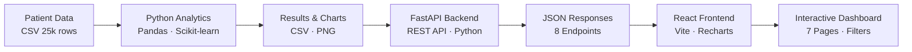

### Tech Stack

| Layer | Technologies |
|-------|-------------|
| **Analytics** | Python · Pandas · NumPy · Scikit-learn · Matplotlib · Seaborn |
| **Backend** | FastAPI · Uvicorn · Python |
| **Frontend** | React · Vite · JavaScript · Recharts |
| **Data** | CSV files · SQL |
| **Deployment** | Vercel · [Live Demo](https://patient-journey-analytics.vercel.app) |

### Dashboard Pages

| Page | Description |
|------|-------------|
| **Overview** | 5 KPIs + journey funnel + adoption charts + insights |
| **Patient Journey** | Full funnel + biggest drop-off + stage table |
| **Treatment Adoption** | 5 charts across all patient dimensions |
| **Patient Segments** | Segment distribution + adoption + table |
| **Market Opportunity** | Ranked regions + opportunity scores |
| **Model Insights** | Logistic regression metrics + coefficients |
| **About** | Project overview + architecture + disclaimer |

### Run Locally

#### Option A — Separate terminals (recommended for development)

**Terminal 1 — Backend:**
```bash
pip install -r requirements.txt
uvicorn api.index:app --reload --port 8000
```

**Terminal 2 — Frontend:**
```bash
cd frontend
npm install
npm run dev
```

Then open: **http://localhost:5173**

> Or use the **[Live Demo](https://patient-journey-analytics.vercel.app)** — no setup required.

#### Option B — Build and serve frontend statically
```bash
cd frontend && npm run build
# Serve dist/ with any static server
```

### API Endpoints

| Method | Endpoint | Description |
|--------|----------|-------------|
| GET | `/api/health` | API health check |
| GET | `/api/overview` | KPIs + summary stats |
| GET | `/api/patient-journey` | Funnel stages + drop-offs |
| GET | `/api/adoption` | Adoption by all dimensions |
| GET | `/api/segments` | Patient segment analysis |
| GET | `/api/market-opportunity` | Regional opportunity scores |
| GET | `/api/model-insights` | Logistic regression results |
| GET | `/api/filters/options` | Valid filter dropdown values |

All endpoints accept optional query parameters: `region`, `gender`, `age_group`, `insurance`, `severity`.

---

## Project Overview

This end-to-end data analytics project analyses the **patient treatment journey** for a fictional pharmaceutical company (NovaCure Pharmaceuticals) and their fictional drug **Therapy X**.

Using a synthetic dataset of **25,000 patients**, the project answers key business questions about why patients do or do not start treatment, where they drop off in the journey, and which regions represent the highest market opportunity.

The project demonstrates skills in **Python analytics, SQL, data visualisation, segmentation, logistic regression modelling, FastAPI backend development, and React frontend development** — all at a beginner-to-intermediate level with a strong focus on business insight rather than technical complexity.

---

## Business Problem

NovaCure Pharmaceuticals has launched Therapy X for a chronic condition. Despite widespread availability, only **43.3% of diagnosed patients** ever start the treatment. The company needs to understand:

- Where patients are dropping off in the treatment journey
- Which patient groups are most and least likely to adopt treatment
- What the biggest barriers to adoption are
- Which regions have the most untreated patients and highest growth potential
- What the company should prioritise to improve adoption

---

## Objectives

1. Map the complete patient journey from diagnosis to follow-up
2. Identify the biggest drop-off point in the patient journey
3. Segment patients into business-meaningful groups
4. Analyse treatment adoption across key dimensions (insurance, severity, cost, physician recommendation)
5. Identify factors most associated with treatment adoption using logistic regression
6. Quantify regional market opportunities
7. Deliver actionable business recommendations

---

## Key Business Questions

1. What is the overall treatment adoption rate?
2. Where in the patient journey are the largest drop-offs?
3. How does insurance status affect adoption?
4. Does disease severity influence whether patients start treatment?
5. Does a physician recommendation significantly improve adoption?
6. How does treatment cost relate to adoption?
7. Which patient segments have the highest unmet need?
8. Which regions have the most untreated patients?
9. What factors are most strongly associated with treatment initiation?
10. What should the company prioritise?

---

## Dataset

| Property | Detail |
|----------|--------|
| **Source** | Synthetic data generated by `src/generate_data.py` |
| **Records** | 25,000 patients |
| **Period** | January 2021 – December 2023 |
| **Primary file** | `data/patient_data_clean.csv` |
| **Columns** | 25 columns (demographics, clinical factors, journey stages, scores) |

**Key columns:**

| Column | What it captures |
|--------|-----------------|
| `Patient_ID` | Unique patient identifier |
| `Age`, `Gender`, `Region`, `State` | Demographics |
| `Insurance_Status` | Insured / Underinsured / Uninsured |
| `Disease_Severity` | Mild / Moderate / Severe |
| `Treatment_Cost` | Estimated cost in USD |
| `Affordability_Score` | Financial ability to afford treatment (0–10) |
| `Healthcare_Access_Score` | Access to care quality (0–10) |
| `Treatment_Recommended` | Did a physician recommend Therapy X? |
| `Treatment_Started` | **Primary adoption metric** (0/1) |
| `Drop_Off_Stage` | Where the patient left the journey |

For full column descriptions, see [`docs/data_dictionary.md`](docs/data_dictionary.md).

---

## Tools & Technologies

| Tool | Purpose |
|------|---------|
| **Python** | Core analysis language |
| **Pandas** | Data manipulation and aggregation |
| **NumPy** | Numerical operations |
| **Matplotlib / Seaborn** | Data visualisation |
| **Scikit-learn** | Logistic regression modelling |
| **FastAPI** | REST API backend |
| **React + Vite** | Interactive web dashboard frontend |
| **Recharts** | Chart library for the React dashboard |
| **SQL** | Business analysis queries (SQLite/MySQL/PostgreSQL) |
| **Jupyter Notebook** | Interactive exploration and walkthrough |

---

## Project Workflow

```mermaid
flowchart LR
    A[Business Problem] --> B[Synthetic Data Generation]
    B --> C[Data Cleaning & Validation]
    C --> D[Exploratory Data Analysis]
    D --> E[Patient Journey Funnel]
    E --> F[Patient Segmentation]
    F --> G[Adoption Analysis]
    G --> H[Logistic Regression]
    H --> I[Market Opportunity]
    I --> J[FastAPI Backend]
    J --> K[React Dashboard]
    K --> L[Insights & Recommendations]
```

**One-command execution:**
```bash
python src/run_project.py
```

---

## Repository Structure

```
patient-journey-treatment-adoption-analytics/
│
├── README.md                          # This file
├── requirements.txt                   # Python + backend dependencies
├── vercel.json                        # Vercel deployment config
├── .gitignore                         # Files excluded from git
├── LICENSE                            # MIT License
│
├── api/                               # ── FastAPI Backend ──
│   ├── index.py                       # 8 REST API endpoints
│   └── requirements.txt               # Backend-specific deps
│
├── frontend/                          # ── React Frontend ──
│   ├── package.json
│   ├── vite.config.js                 # Vite + /api proxy config
│   ├── index.html
│   └── src/
│       ├── main.jsx
│       ├── App.jsx
│       ├── index.css                  # Complete design system
│       ├── api/
│       │   └── analyticsApi.js        # Central API client
│       ├── components/
│       │   ├── Sidebar.jsx
│       │   ├── KPICard.jsx
│       │   ├── ChartCard.jsx
│       │   ├── FiltersBar.jsx
│       │   └── LoadingState.jsx
│       └── pages/
│           ├── Overview.jsx
│           ├── PatientJourney.jsx
│           ├── TreatmentAdoption.jsx
│           ├── Segments.jsx
│           ├── MarketOpportunity.jsx
│           ├── ModelInsights.jsx
│           └── About.jsx
│
├── data/
│   ├── patient_data.csv               # Raw synthetic dataset (25,000 rows)
│   └── patient_data_clean.csv         # Cleaned dataset with derived columns
│
├── src/
│   ├── generate_data.py               # Generates synthetic patient dataset
│   ├── clean_data.py                  # Cleans and validates the data
│   ├── analyze.py                     # Full analysis pipeline
│   └── run_project.py                 # One-command pipeline runner
│
├── sql/
│   ├── business_analysis.sql          # 20 business SQL queries
│   └── README.md                      # SQL import instructions
│
├── notebooks/
│   └── healthcare_analysis.ipynb      # Interactive analysis notebook
│
├── results/                           # CSV outputs from Python pipeline
├── outputs/                           # PNG charts from Python pipeline
├── reports/                           # Markdown business reports
├── powerbi/                           # Power BI dashboard specification
└── docs/                              # Data dictionary & methodology
```

---

## How to Run

### Prerequisites
```bash
git clone https://github.com/sajal-tyagi/patient-journey-treatment-adoption-analytics.git
cd patient-journey-treatment-adoption-analytics
pip install -r requirements.txt
```

### Run the Full Pipeline (One Command)
```bash
python src/run_project.py
```

This runs all three steps in sequence:
1. Generates `data/patient_data.csv` (25,000 patients)
2. Cleans and validates → `data/patient_data_clean.csv`
3. Runs full analysis → saves results, charts, and reports

**Expected runtime:** ~15 seconds

### Run Steps Individually
```bash
python src/generate_data.py   # Step 1: Generate data
python src/clean_data.py      # Step 2: Clean data
python src/analyze.py         # Step 3: Analyse and produce outputs
```

### Open the Notebook
```bash
jupyter notebook notebooks/healthcare_analysis.ipynb
```

### Run SQL Queries
See [`sql/README.md`](sql/README.md) for import instructions (SQLite, MySQL, PostgreSQL).

---

## Data Cleaning

The cleaning script (`src/clean_data.py`) performed the following checks:

| Check | Result |
|-------|--------|
| Duplicate Patient IDs | None found ✓ |
| Missing values (non-date columns) | None found ✓ |
| Invalid ages (<18 or >100) | None found ✓ |
| Score values out of [0,10] range | None found ✓ |
| Negative treatment costs | None found ✓ |
| Treatment start before diagnosis | None found ✓ |
| Recommendation without consultation | None found ✓ |
| Continuation without starting | None found ✓ |
| Follow-up without continuation | None found ✓ |
| Invalid categorical values | None found ✓ |

The synthetic data generator was built to produce clean, logically consistent data. Two derived columns were added during cleaning: `Age_Group` and `Cost_Band`.

Full results: [`results/data_quality_summary.csv`](results/data_quality_summary.csv)

---

## Patient Journey Analysis

### Analysis
We tracked 25,000 patients through 6 stages: Diagnosis → Doctor Consultation → Treatment Recommended → Treatment Started → Treatment Continued → Follow-up Completed.

### Result

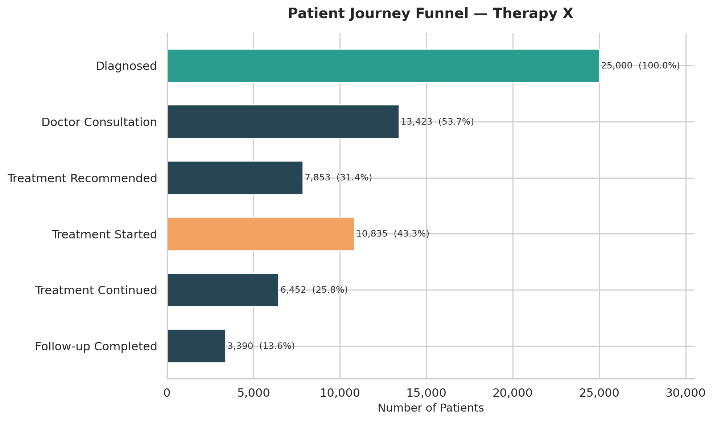

| Stage | Patients | % of Diagnosed | Drop-off % |
|-------|----------|----------------|------------|
| Diagnosed | 25,000 | 100.0% | — |
| Doctor Consultation | 13,423 | 53.7% | **46.3%** |
| Treatment Recommended | 7,853 | 31.4% | 41.5% |
| Treatment Started | 10,835 | 43.3% | — |
| Treatment Continued | 6,452 | 25.8% | 40.5% |
| Follow-up Completed | 3,390 | 13.6% | 47.5% |

*Note: Treatment Started is higher than Recommended because some patients started without a formal recommendation — a realistic pattern in the data.*

### Interpretation
The **biggest single drop-off** occurs between **Diagnosis and Doctor Consultation** — 46.3% of diagnosed patients never consult a physician. This is followed closely by a large drop between Consultation and Treatment Recommendation.

### Business Implication
If the company can increase the proportion of patients who see a doctor after diagnosis, the downstream adoption numbers will improve significantly. Patient awareness campaigns and improved access to care are critical at this stage.

---

## Patient Segmentation

### Analysis
We created 6 business segments using two dimensions:
- **Need Level:** High-Need (Moderate/Severe disease) vs Low-Need (Mild)
- **Ability Level:** High / Medium / Low (based on insurance + affordability score)

### Result

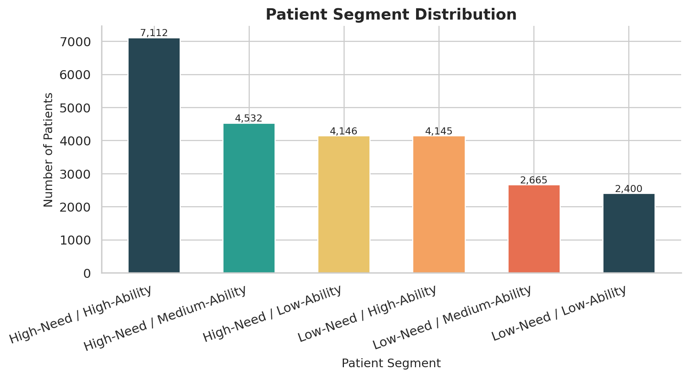
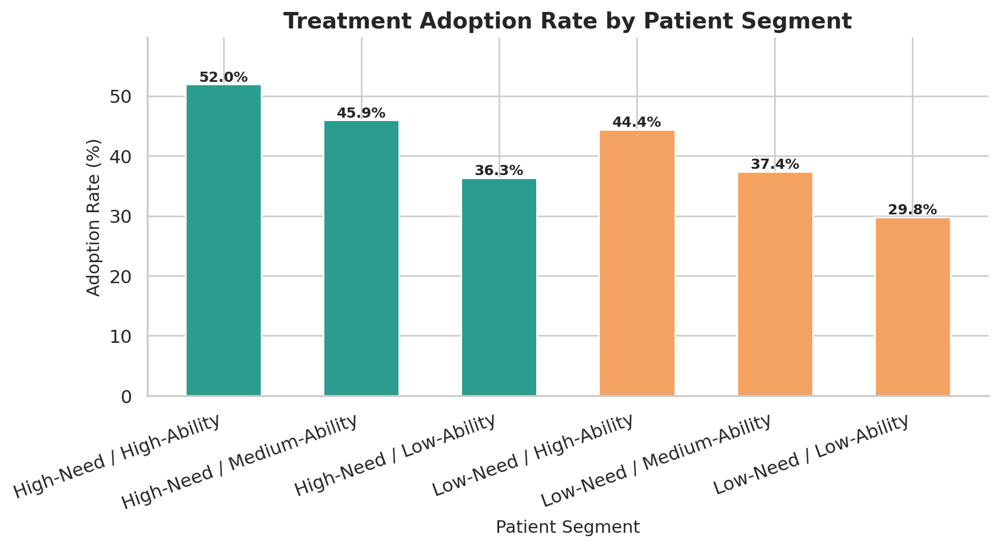

| Segment | Total Patients | Adoption Rate | Untreated |
|---------|---------------|---------------|-----------|
| High-Need / High-Ability | 7,112 | **52.0%** | 3,417 |
| High-Need / Medium-Ability | 4,532 | 45.9% | 2,450 |
| Low-Need / High-Ability | 4,145 | 44.4% | 2,304 |
| High-Need / Low-Ability | 4,146 | 36.3% | **2,640** |
| Low-Need / Medium-Ability | 2,665 | 37.4% | 1,669 |
| Low-Need / Low-Ability | 2,400 | 29.8% | 1,685 |

### Interpretation
Even the highest-priority segment (High-Need / High-Ability) has an adoption rate of only 52%. The High-Need / Low-Ability segment has 2,640 untreated patients who most urgently need support programmes.

### Business Implication
Different segments require different interventions. High-Need / High-Ability patients may need physician education. High-Need / Low-Ability patients need financial and access support.

---

## Treatment Adoption Analysis

### Analysis
We compared the treatment adoption rate across multiple dimensions.

### Overall Rate: 43.3%

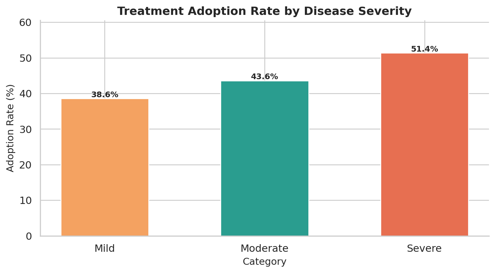
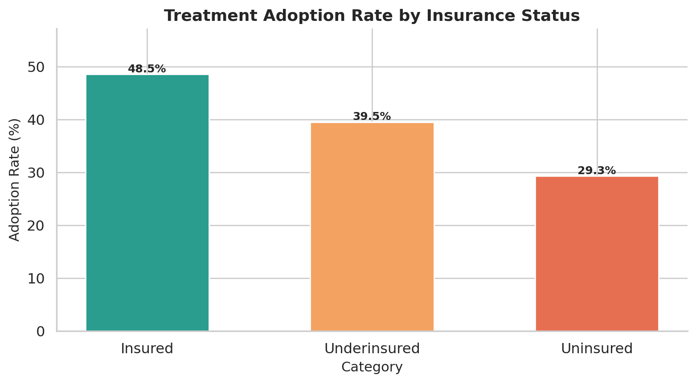

| Dimension | Category | Adoption Rate |
|-----------|----------|--------------|
| Disease Severity | Severe | **51.4%** |
| Disease Severity | Moderate | 43.6% |
| Disease Severity | Mild | 38.6% |
| Insurance | Insured | **48.5%** |
| Insurance | Underinsured | 39.5% |
| Insurance | Uninsured | **29.3%** |
| Recommendation | Physician Recommended | **64.0%** |
| Recommendation | Not Recommended | 33.9% |
| Cost Band | Low (<$15k) | **48.3%** |
| Cost Band | Very High (>$60k) | **26.1%** |

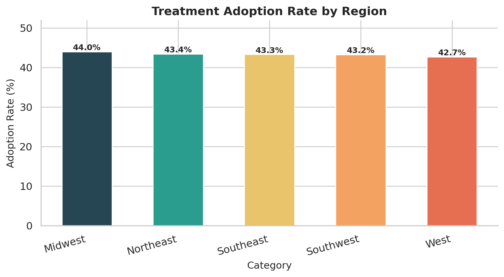
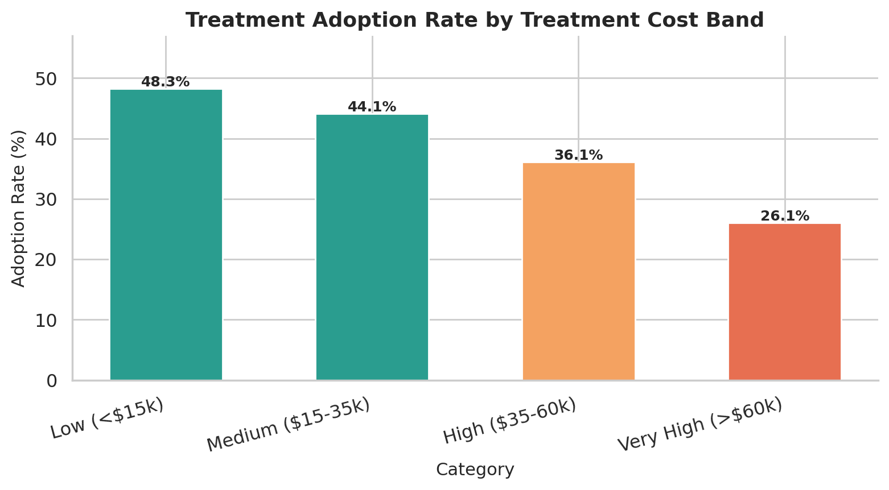

### Interpretation
The data reveals clear, consistent patterns:
- Higher disease severity is associated with higher adoption (urgency drives action)
- Insurance coverage has a large impact — uninsured patients adopt at only 29.3%
- Physician recommendation nearly doubles the adoption rate (33.9% → 64.0%)
- Treatment cost is a significant barrier — very high cost ($60k+) cuts adoption nearly in half

### Business Implication
Physician engagement and affordability support are the two highest-leverage interventions.

---

## Adoption Drivers

### Analysis
We used a simple Logistic Regression model to identify which factors are most strongly *associated* with treatment adoption. This is an associative analysis — not a causal one.

**Target variable:** `Treatment_Started` (1 = started, 0 = did not start)  
**Features:** 10 patient-level variables

### Result

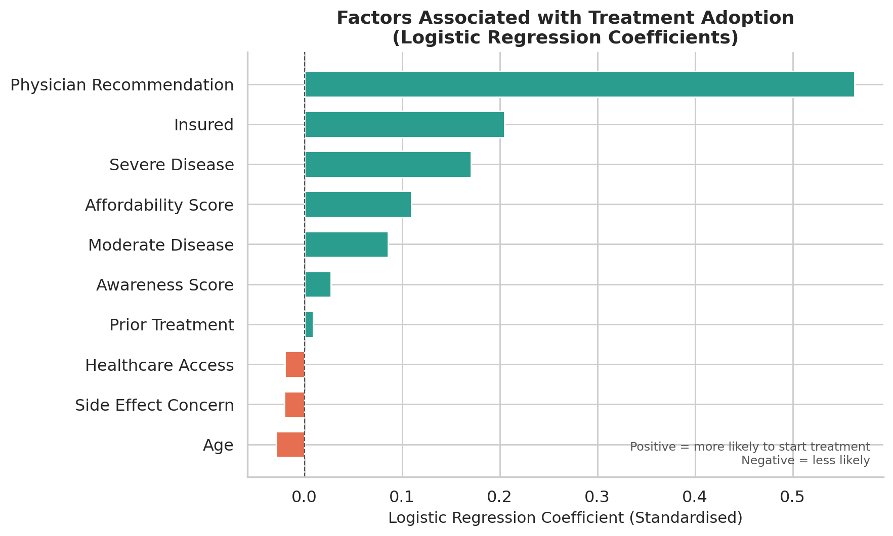

| Metric | Value |
|--------|-------|
| Accuracy | 65.9% |
| Precision | 65.1% |
| Recall | 46.2% |
| F1 Score | 54.0% |
| **ROC-AUC** | **0.686** |

### Top Positive Factors (associated with adoption)
1. **Physician Recommendation** — strongest positive predictor
2. **Insured status** — significantly increases probability
3. **Severe disease** — urgency drives action

### Top Negative Factors (associated with non-adoption)
1. **Side Effect Concern** — fear of side effects reduces initiation
2. **Low Affordability** — financial barriers reduce adoption
3. **High Treatment Cost** — cost is a deterrent

### Interpretation
The model confirms the patterns seen in simple group comparisons. A ROC-AUC of 0.686 indicates the model is meaningfully better than random guessing. The most actionable factors are physician recommendation, insurance, and affordability — all of which can be addressed through company programmes.

> ⚠️ **Note:** These are *associations*, not causes. Correlation ≠ causation.

---

## Market Opportunity

### Analysis
For each region, we calculated the number of untreated patients and the adoption gap, then combined them into a simple Opportunity Score.

### Result

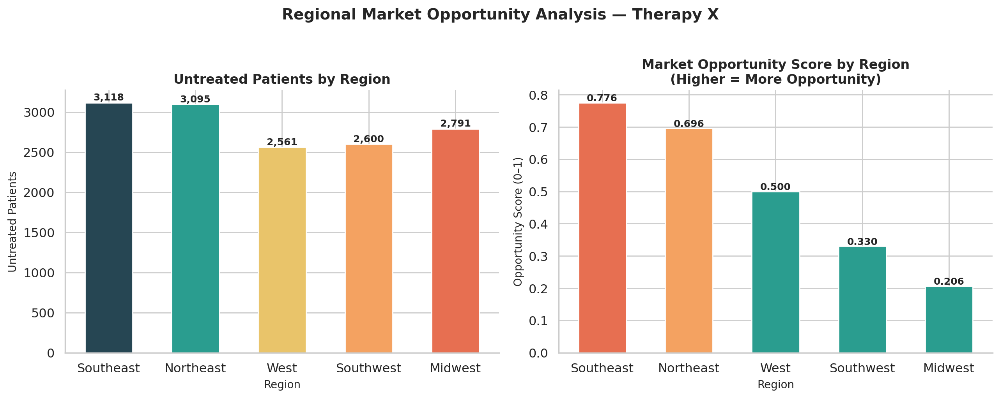

| Region | Total Patients | Untreated | Adoption Rate | Opportunity Score |
|--------|---------------|-----------|---------------|------------------|
| **Southeast** | 5,497 | **3,118** | 43.3% | **0.776** |
| Northeast | 5,471 | 3,095 | 43.4% | 0.696 |
| West | 4,470 | 2,561 | 42.7% | 0.500 |
| Southwest | 4,580 | 2,600 | 43.2% | 0.330 |
| Midwest | 4,982 | 2,791 | 44.0% | 0.207 |

Full results: [`results/market_opportunity.csv`](results/market_opportunity.csv)

### Interpretation
The **Southeast** region has the highest opportunity score — driven by a large untreated patient population (3,118) combined with a lower adoption rate. The **Northeast** is a close second.

### Business Implication
Concentrating commercial and medical education resources in the Southeast and Northeast is likely to deliver the greatest return. The Midwest, while having many untreated patients, already has the highest adoption rate — indicating lower relative opportunity.

---

## Optional Power BI Reference

The interactive dashboard for this project is built with **React + FastAPI** (see the `frontend/` and `api/` directories). As an additional reference for data analysts working in Microsoft environments, the `powerbi/` folder contains a specification for an equivalent Power BI dashboard:

- [`powerbi/dashboard_specification.md`](powerbi/dashboard_specification.md) — 5-page dashboard layout spec
- [`powerbi/dax_measures.md`](powerbi/dax_measures.md) — DAX measures ready to paste into Power BI Desktop

> **Note:** Power BI is an optional reference only. The actual deployed project uses the React web dashboard.

---

## Key Findings

1. **43.3% of diagnosed patients start Therapy X** — leaving a large untreated pool
2. **The biggest drop-off is between Diagnosis and Doctor Consultation** (46.3% lost at this step)
3. **Physician recommendation nearly doubles adoption** — 64.0% vs 33.9% without it
4. **Insurance status is a major barrier** — uninsured patients adopt at only 29.3% vs 48.5% for insured
5. **Very high treatment cost cuts adoption in half** — 48.3% (Low cost) vs 26.1% (Very High cost)
6. **The Southeast region has the highest market opportunity** — 3,118 untreated patients
7. **Side effect concern is a barrier** — negatively associated with adoption in the logistic regression
8. **High-severity patients still have imperfect adoption** — even the most urgent patients face barriers

Full findings: [`reports/key_findings.md`](reports/key_findings.md)

---

## Business Recommendations

1. **Invest in Physician Education & Engagement** — the highest-return intervention
2. **Expand Patient Affordability Programmes** — targeting uninsured/underinsured patients
3. **Focus Commercial Resources on the Southeast Region** — highest opportunity score
4. **Intervene at the Diagnosis → Consultation Stage** — where most patients are lost
5. **Proactively Address Side Effect Concerns** — via patient education materials
6. **Monitor Adoption and Continuation Together** — starting treatment is only part of the goal

Full recommendations: [`reports/business_recommendations.md`](reports/business_recommendations.md)

---

## Conclusion

The analysis reveals that Therapy X has significant untapped potential. With only **43.3% of diagnosed patients** starting treatment, and just **25.8%** continuing after initiation, there is a clear opportunity to improve patient outcomes and commercial performance.

The **biggest immediate opportunity** is improving the pathway from diagnosis to physician consultation — where nearly half of all patients are lost before even reaching a treatment conversation.

**Three priorities** stand out:
1. Physician engagement (doubles adoption probability)
2. Insurance/affordability support (most impactful for access)
3. Southeast region focus (highest opportunity concentration)

Full conclusion: [`reports/conclusion.md`](reports/conclusion.md)

---

## Limitations

- **Synthetic data** — all results are based on artificially generated data, not real patients
- **No causal inference** — logistic regression shows associations, not causation
- **Simplified healthcare assumptions** — real healthcare decisions involve far more complexity
- **Simplified market opportunity model** — real opportunity assessment requires competitor data, HCP density, payer mix, and more
- **No time-series forecasting** — the analysis is descriptive and static, not predictive in the forecasting sense
- **No real-world validation** — findings cannot be applied to real clinical or commercial strategy without validation

---

## Future Improvements

With access to real-world data, this project could be extended to include:

- **Real patient claims data** for true journey analysis
- **Physician-level data** to identify HCP engagement opportunities
- **Prescription and refill data** for genuine persistence analysis
- **Competitor treatment data** for proper market share analysis
- **More granular geographic data** (county/zip-code level)
- **Predictive modelling** using real historical data with proper validation
- **Longitudinal analysis** tracking patient cohorts over time

---

## SQL Analysis

The project includes **20 business SQL queries** covering all major analytical questions.

See [`sql/business_analysis.sql`](sql/business_analysis.sql) for the full query file.  
See [`sql/README.md`](sql/README.md) for SQLite / MySQL / PostgreSQL import instructions.

**Sample queries include:**
- Overall adoption rate
- Adoption by region, insurance, severity, cost
- Patient journey funnel drop-off analysis
- High-risk untreated patient identification (CTE)
- Market opportunity ranking (Window functions)

---

## Disclaimer

> This project uses **synthetic data** created for analytical and educational purposes only.
> It does not represent real patients, real clinical outcomes, medical advice, or actual
> pharmaceutical market data.
>
> All company names, drug names, and patient data in this project are entirely fictional.
> Any resemblance to real persons, companies, or clinical situations is purely coincidental.
>
> This project is intended as a portfolio demonstration of data analytics skills and should
> not be used to inform real clinical or business decisions.

---

*Built with Python · Pandas · NumPy · Matplotlib · Seaborn · Scikit-learn · FastAPI · React · Vite · Recharts · SQL*
